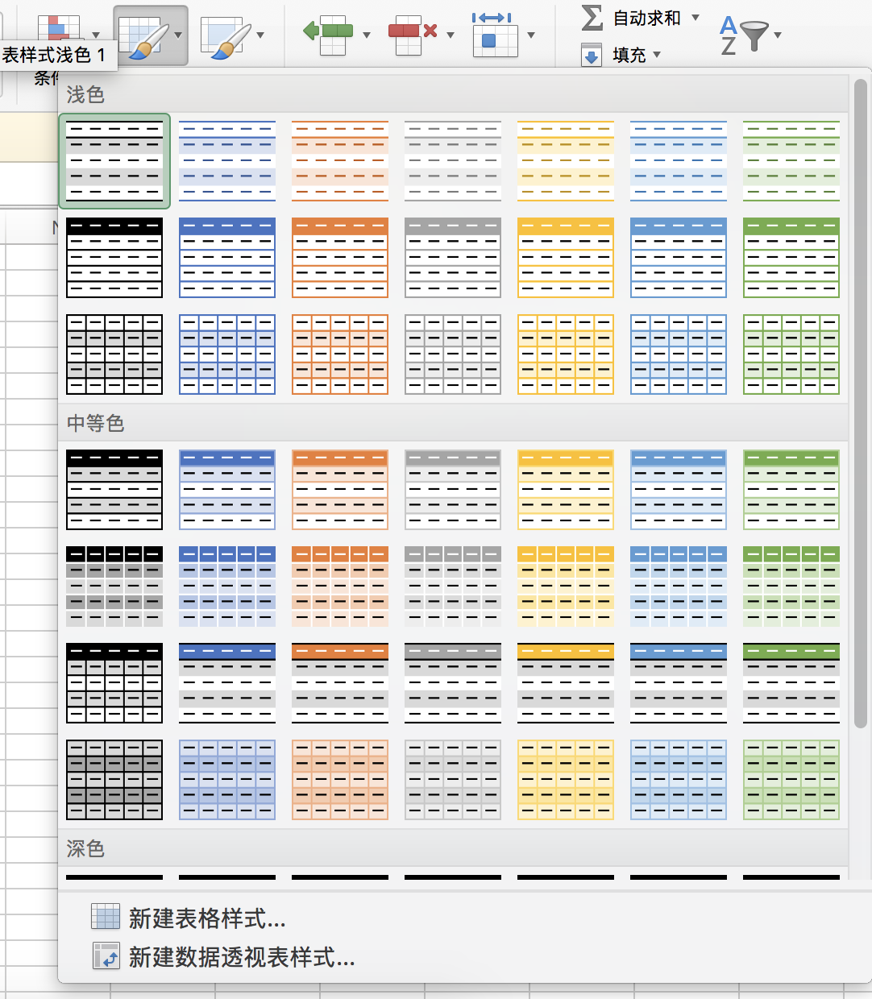

# SPSS软件应用训练课程材料

## 关于本课程

统计学的基本知识和初步的数据处理能力是每一位医学生工具箱里都应该准备的基本工具。商业软件如SPSS和Excel的普及让我们可以非常方便的完成统计工作，但是对于基本统计概念的理解才能让你走的更远。这个git是本课程各种资料的集合，本页面是所有资料的索引。你可以clone这个git或者选择下载zip文件获取课程的学习材料。

### 基本信息

1. 实验类别：专业基础实验，课程性质：限选，课程学分：1
2. 实验总学时：16
3. 应开实验个数：8必开实验个数：8选开实验个数：0
4. 适用专业：药学专业
5. 考核方式：平时作业+期末考察
6. 实验成绩评定方法：平时实验报告成绩占50%，期末设计作业成绩占50%
7. 实验成绩占课程总成绩比例：100%
8. 实验教材或自编指导书：
    1. 医学统计学与SPSS软件实现方法（第一版），郭秀花，北京科学出版社
9. 参考教材及建议阅读：
    1. 数理统计初级教程，G·H·维恩堡，等，山西人民出版社
    2. 医学统计学与电脑实验，方积乾，等，上海科学技术出版社

### 实验项目列表

|实验编号 | 实验项目名称 | 实验类型 | 实验学时|
|--|--|--|--|
|实验一 | 医学统计学基本概念与SPSS使用 | 演示 | 2|
|实验二 | 数值变量的统计描述与正态分布 | 综合 | 2|
|实验三 | 计量资料的统计推断及抽样试验 | 综合 | 2|
|实验四 | 方差分析与分类资料的统计描述 | 综合 | 2|
|实验五 | 分类变量资料的统计推断 | 综合 | 2|
|实验六 | 秩和检验 | 综合 | 2|
|实验七 | 医学科研设计 | 综合 | 2|
|实验八 | 医学科研数据分析 | 设计 | 2|

## 课程资源列表

### 实验1 医学统计学基本概念与软件使用

1. 参照课本第2章
2. 实验数据：
    1. [例2-1](experiments/e1/table2_1.csv)
    2. [例2-4-1](experiments/e1/table2_4_1.csv)
    3. [例2-4-2](experiments/e1/table2_4_2.csv)
    4. [例2-5](experiments/e1/table2_5.csv)
    5. [例2-6](experiments/e1/table2_6.csv)
    6. [例2-7](experiments/e1/table2_7.csv)
3. 作业题：
    1. [作业数据](experiments/e1/table2_0.csv)

#### Excel的若干常用操作

一下操作采用的数据均来自table2_1.csv

##### 1. 数据表

在Excel里要进行数据分析应该保证表格下面几个条件

1. 有表头，表头是各列的`变量名`
2. 每一行代表一个`记录`，或者说`样本`
3. 每一列代表一个`变量`
4. 没有合并单元格

##### 2. 套用表格格式

使用Excel处理数据的第一步是把普通的工作表转成数据表。这是一个普通的工作表：

操作步骤:

1. 在工作表区域里点一个单元格点`套用表格格式`
   
2. 任意选取一个格式
   
3. 检查数据区域是否正确, 是否包含表头
   
4. 完成
   

##### 3. 筛选排序

套用表格格式后，筛选和排序可以直接在数据表区域完成，点击表头的`三角按钮`

在弹出菜单中选取筛选或者排序

##### 4. 数据透视表

Excel的数据透视表类似于`分析>描述统计>交叉表`,对于简单的数据探索很有帮助,值得花些时间来学习.

插入步骤

1. 将光标移动到数据表中
2. 插入>数据透视表
3. 采用默认设置
   
4. 为`行`和`列`选择变量,为`值`选择变量
   

如果我想知道对照组/病例组和男/女这个2x2交叉表中各个类别的平均年龄:

1. 行选择group
2. 列选择sex
3. 值选择age,字段设置成平均值
   

##### 5. 公式

假设现在有一个公式计算样本患有胃癌的风险评分:`H = 年龄*0.2+吸烟*0.3+饮酒*0.08`, 在Excel中可以这样计算出这个变量:

1. 在表格右侧新建一列,表头为`Hscore`
2. 下方第一个单元格输入公式`=[@age]*0.2+[@smoking]*0.3+[@drinking]*0.08`
3. 完成

可以看到, 在套用表格格式以后, 公式是会自动向下填充的

##### 6. 分列

一般而言Excel都可以顺利打开csv文件,但是有时候也可能遇到下面这种情况:
, 这种时候需要用`分列`操作

步骤:

1. 选中第一列
2. 数据>分列
3. 选用`分隔符号`作分列
4. 选择正确的分隔符
5. 完成剩余设置

##### 7. 文本向数字转化以及match,offset

有的时候我们拿到的数据不一定是`table2_1.csv`这样编好码的数据, 也可能是像`table2_1_rev.xlsx`这样的未编码数据(下图左方所示). 这个时候要怎么自动进行编码呢?

1. 首先你需要做一个辅助表`aux`,以`0: control, 1: case`这一个对应关系为例辅助表应如下表所示

group | code
------- | -------
control |0
case | 1

2. 然后利用`vlookup`公式进行自动查找和替换,仍旧以group这一列为例,右侧数据表内`K2`单元格的公式是`=VLOOKUP(B2,aux!A:B,2,FALSE)`, 将这个公式向下填充
3. 其他列同理替换
4. 对于`test_score`>`grade`这一个转换,注意aux里面对应的表格是这样的:

score | grade
------- | -------
0 | F-
30 | F
60 | C
80 | B
90 | A
100 | A+

而Vlookup公式为`=VLOOKUP(H2,aux!K:L,2)`, 公式第4个参数未设置(默认为True),这个时侯会进行范围查找,所以对于这种将成绩(或其他连续性变量)转化成类别的操作可以以此作为参照

[table2_1_rev.xlsx文件](experiments/e1/table2_1_rev.xlsx)

#### 如何设置spss的工作文件夹

spss的默认工作文件夹是电脑中的“我的文档”，但是往往我们实际的工作文件夹不在这里，每一次重新选取会比较麻烦。所以请手动设置一下方便后操作。假设现在要将文件夹设置为`D:\spss_data\`。

1. 进入`设置`
2. 选择`文件位置`
3. 设置指定的文件夹，点`浏览`选取对应的文件夹，点`设置`

#### spss软件 Q&A

待更新

####